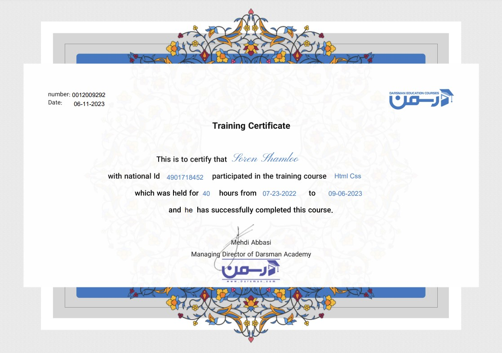
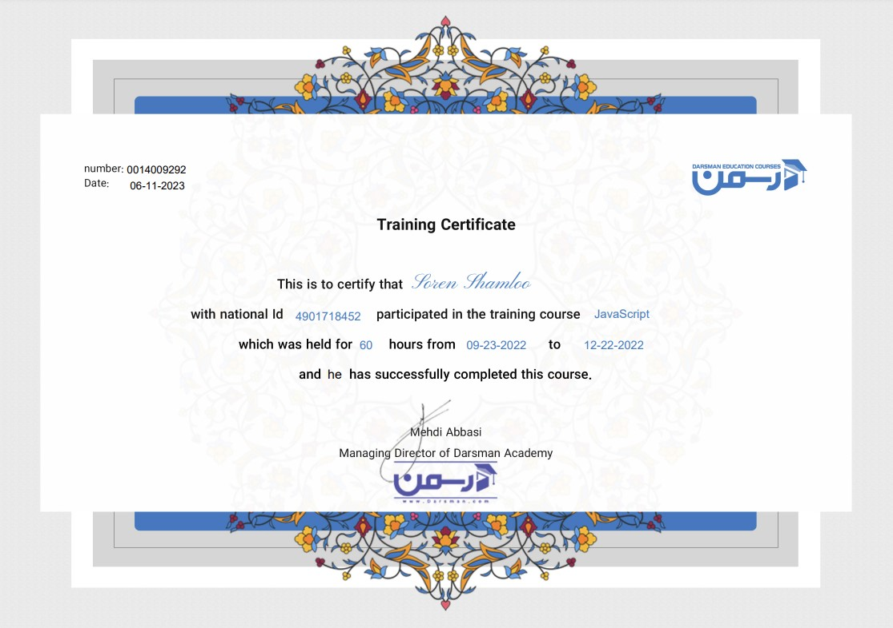

 

    
<h2>  About me </h2>

    
Hello, my name is Soren Shamloo. I am 17 years old and I live in Iran.

    
Since I was 10 years old, I started building circuits and programming hardware with the C language. I programmed and built many robots, and I won first place in the line-following robot competition. Later, I became interested in software programming and began learning the C# programming language, writing my first backend project. From that project onwards, I developed a strong interest in the web domain and entered the field of web development. Hacking and security is another field of interest for me, and I have started working professionally with viruses, BadUSB, and Kali Linux.

    
If I were to introduce one of my projects, I would mention SorenVPN, which is used by over 50,000 people and is active on <a href="https://play.google.com/store/apps/details?id=com.sorenvpnapp.vpnpro">Google Play</a> .

    

 

    
<h2>  Social Media </h2>

    

        
        
        
        
    

 

    
<h2>   Favorite languages and Tools </h2>

    

 

    
<h2>   My various diplomas, certificates </h2>

    

        
        
        
        
        
        <!-- <a href="https://sorenshamlou.ir/" target="_blank"> </as> -->
    

 

    
<h2>   Profile Statistics </h2>

    

        
        
        
         
        
<b>Visitors Count</b>
  
        

 
    

 
